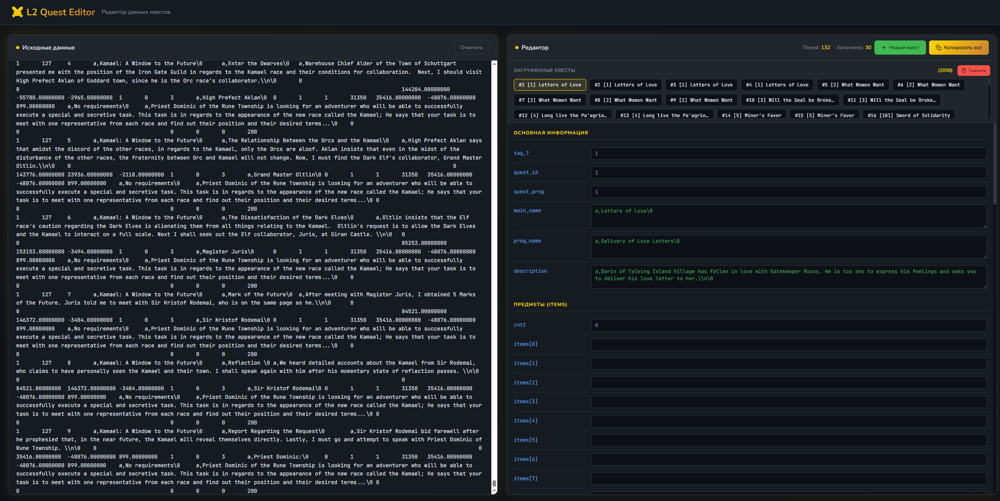

# ⚔️ L2 Quest Editor

Веб-редактор данных квестов для игры Lineage 2. Позволяет удобно просматривать, редактировать и экспортировать данные квестов в табличном формате.


## 🎮 Возможности

- **Парсинг данных** — вставьте данные квестов (TSV-формат) и получите удобный интерфейс редактирования
- **Редактирование полей** — изменяйте любые параметры квеста через структурированную форму
- **Множественные квесты** — работайте с несколькими квестами одновременно, переключаясь между ними
- **Создание квестов** — добавляйте новые квесты с нуля
- **Удаление квестов** — удаляйте ненужные записи
- **Отслеживание изменений** — визуальная индикация изменённых полей
- **Экспорт** — копируйте все данные обратно в TSV-формат

## 📋 Структура данных квеста

Редактор поддерживает следующие группы полей:

| Группа | Описание |
|--------|----------|
| Основная информация | `quest_id`, `quest_prog`, `main_name`, `prog_name`, `description` |
| Предметы | `items[0..13]` — идентификаторы предметов |
| Количество предметов | `num_items[0..13]` — количество каждого предмета |
| Координаты квеста | `quest_x`, `quest_y`, `quest_z` |
| Требования уровня | `lvl_min`, `lvl_max` |
| Параметры квеста | `quest_type`, `entity_name`, `get_item_in_quest` |
| Контактный NPC | `contact_npc_id`, координаты NPC |
| Требуемые классы | `req_class[0..68]` — массив разрешённых классов |
| Требуемые предметы | `req_item[0..4]` — предметы для начала квеста |

## 🚀 Использование

1. Откройте `index.html` в браузере
2. Вставьте данные квестов в левую панель (формат: TSV, каждый квест на новой строке)
3. Редактируйте поля в правой панели
4. Переключайтесь между квестами через навигатор
5. Нажмите «Копировать всё» для экспорта результата

## 🎨 Цветовая индикация полей

- 🟢 **Зелёный** — строковые значения (формат `a,текст\0`)
- 🟣 **Фиолетовый** — числовые значения
- 🟠 **Медный** — координаты (`_x`, `_y`, `_z`)
- 🟡 **Золотой контур** — изменённые поля

## 🛠 Технологии

- HTML5
- CSS3 (CSS Variables, Grid, Flexbox)
- Vanilla JavaScript
- Шрифты: JetBrains Mono, Nunito (Google Fonts)

## 📁 Структура проекта

```
l2-quest-editor/
├── index.html    # Основной файл приложения
├── styles.css    # Стили оформления
└── README.md     # Документация
```

## 💡 Формат данных

Входные данные должны быть в формате TSV (Tab-Separated Values):

```
tag	quest_id	quest_prog	main_name	prog_name	description	...
```

Строковые поля используют формат: `a,Текст строки\0`

## 📜 Лицензия

Этот проект распространяется под лицензией MIT. Подробности см. в файле [LICENSE](LICENSE).

